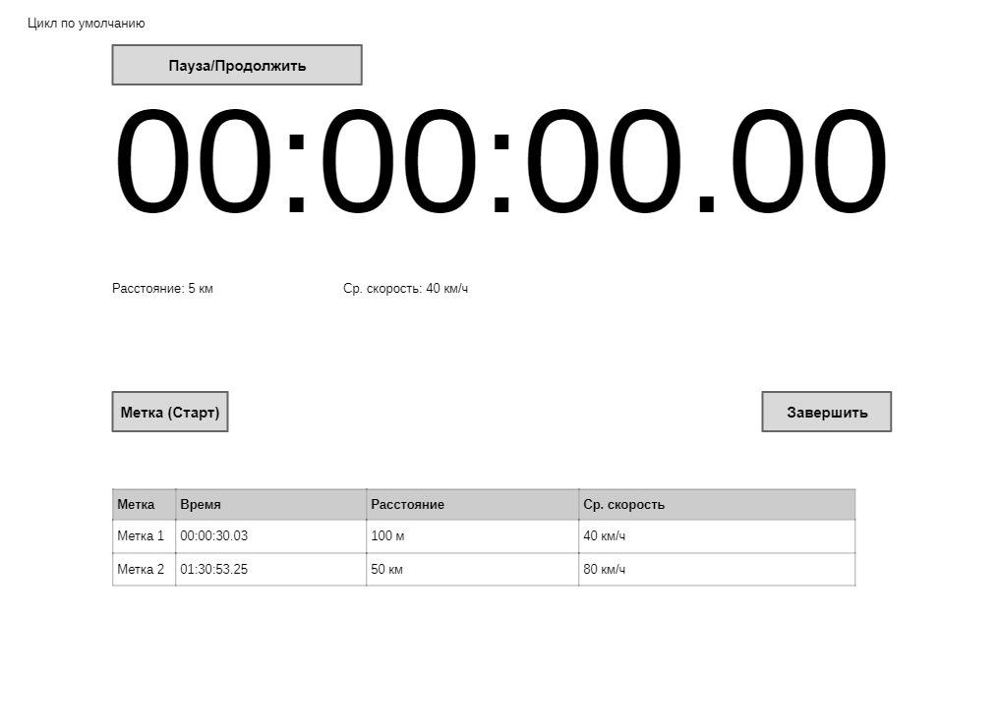
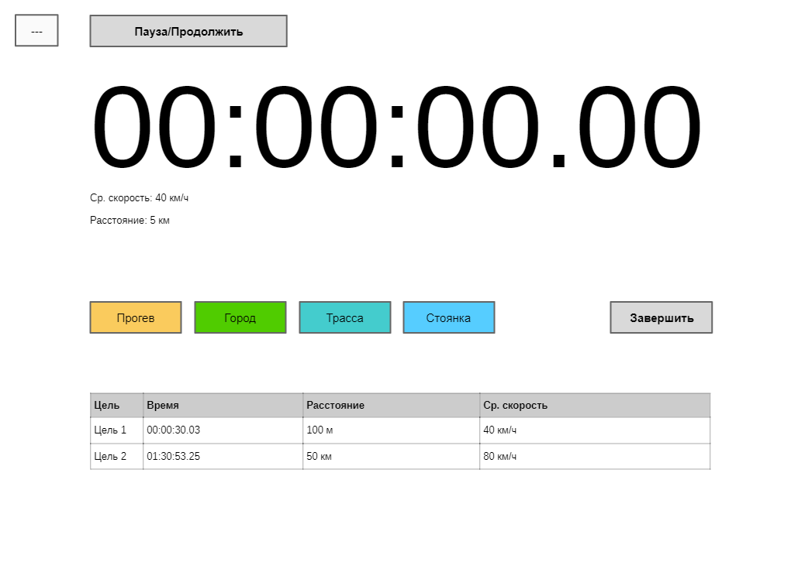
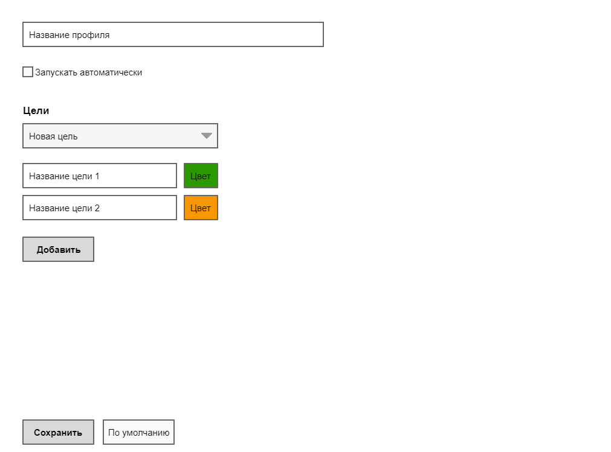
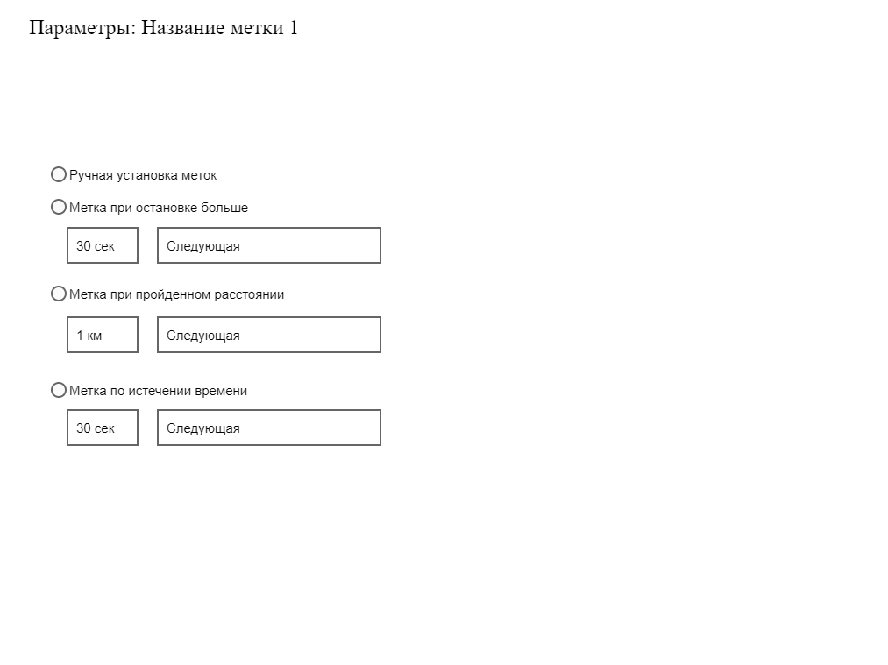

# 2022-11-26 - Idea

My wife and I periodically travel by car to distant lands. We have one car for two.

Every time we switched places, the idea came to me that it would be nice to know how long the driver had been driving.

I would also be interested to know how long we drive on the highway and around the city, how much time we spend warming up the engine in winter.

So the idea was born to create an application that is essentially a stopwatch.

