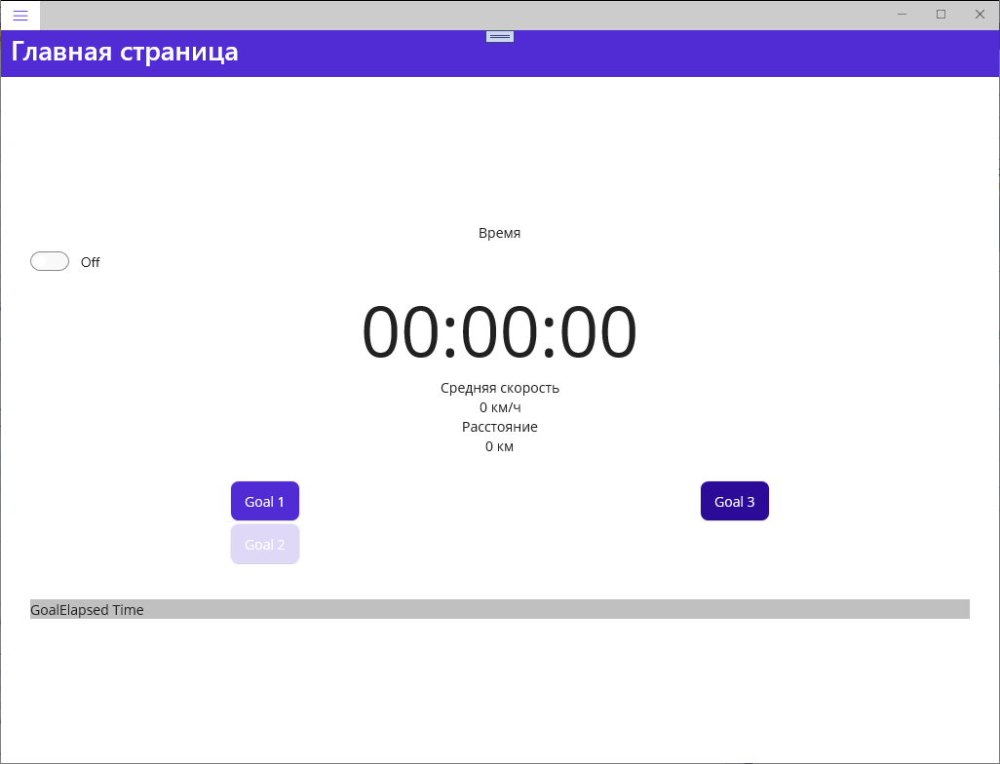
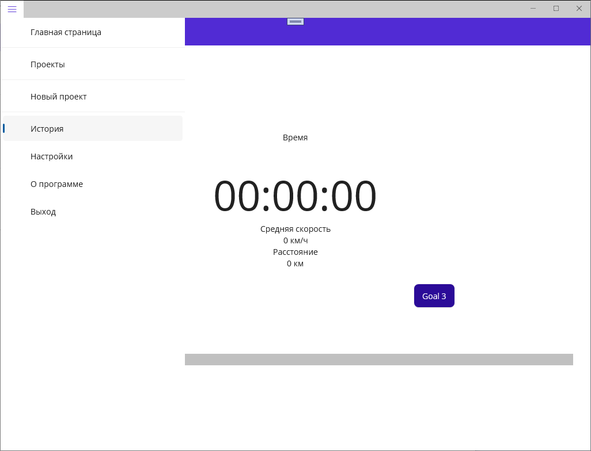
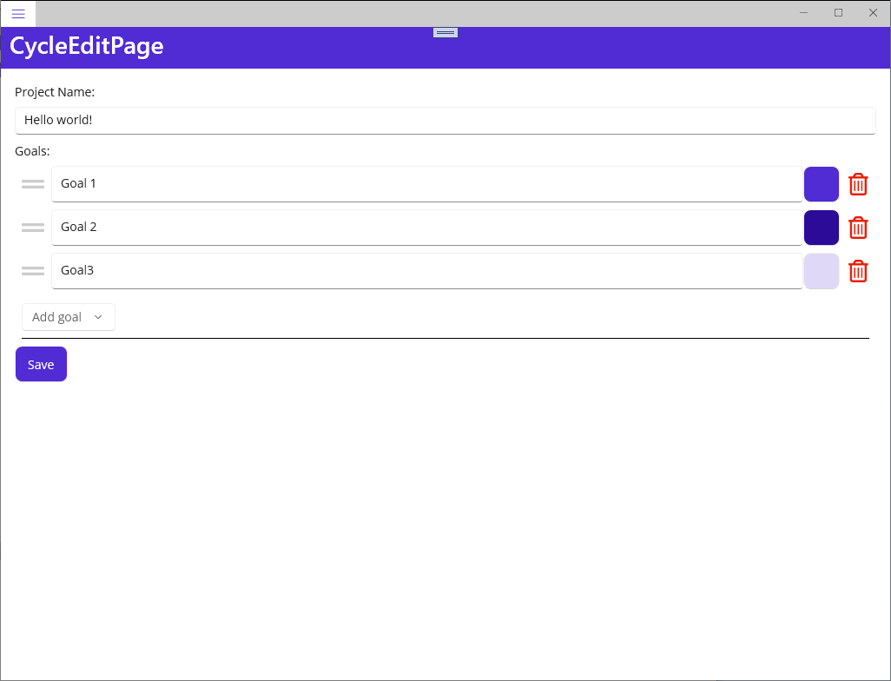
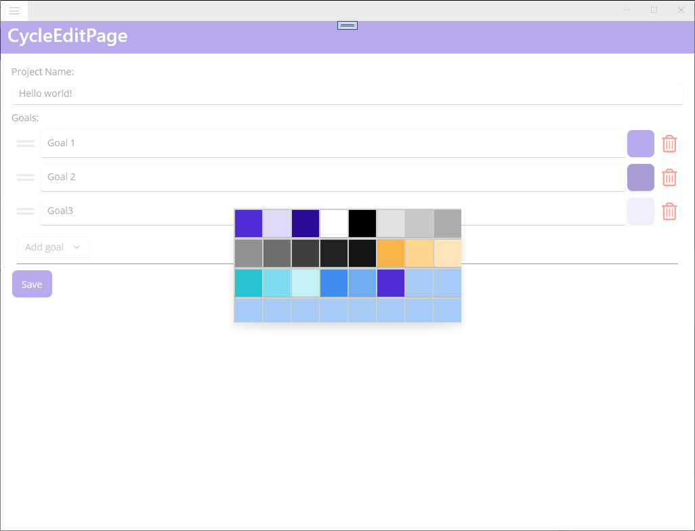

# 2023-02-05 - MAUI

Initially, I started to implement a project on **.NET MAUI**.

I made a backend, but I had a lot of difficulties with frontend implementations.

I eventually switched to **[another .NET MAUI project](https://github.com/alekseynemiro/tapplayer)** which I successfully implemented.

However, it became clear to me that **MAUI** technology is still too immature.
A lot of time has to be spent on studying problems that should not exist and finding workarounds.

As a result, despite the fact that a lot of work was done, I decided to stop using **.NET MAUI**.
I hope someday it will be possible to return to **MAUI**, because **C#** is a good programming language.

